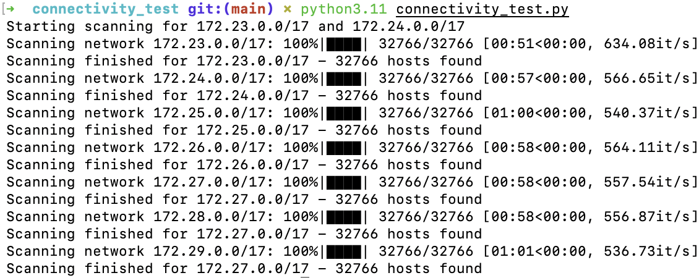

# nerd-scripts
Useful scripts that I use, not all mine.

[connectivity_scan](https://github.com/CofinCup/nerd-scripts/tree/main/connectivity_test) is a multithreading python script that scans the local net for connectivity issues. The script works much faster than Fping(1 min for 32766 successful pings, while fping needs 6min for the same work), and has a fancy progressbar! (AND IT WAS WRITTEN BY CHATGPT, though I spent a lot of time tinkering with the prompts.)

[pomo.sh](https://github.com/CofinCup/nerd-scripts/tree/main/pomo) is a Arch Linux countdown bash script that beeps & gives a system notification when countdown falls to zero.

[get_unread_gmail](https://github.com/CofinCup/nerd-scripts/tree/main/get_unread_gmail) is a python script that gives the unread gmail numbers.

